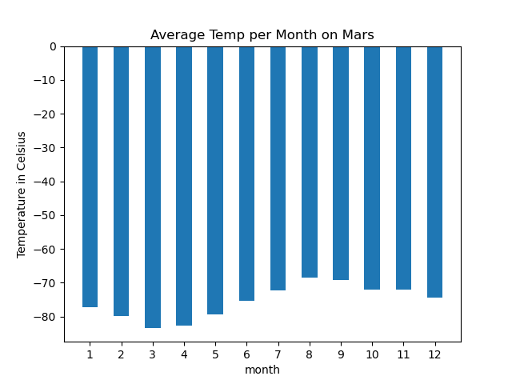
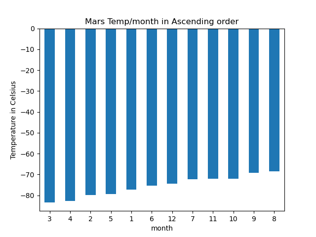
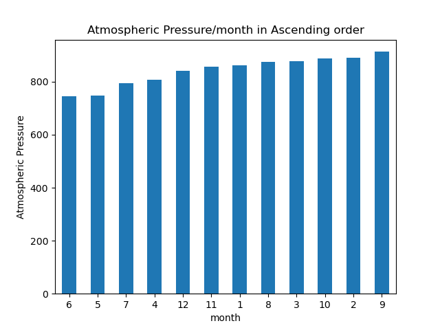
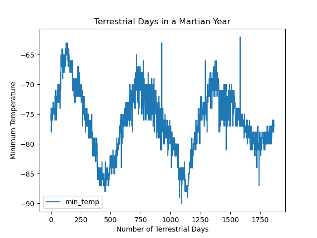

# webscraping-challenge
## Module 11 Challenge Files

This repo contains the following,
- Starter Files Directory containing
    - Part 1 of Web Scraping (scraping titles and previews from the Mars News site) in a Jupyter Notebook
    - Part 2 of Web Scraping (translating scaped info into a Pandas data frame and conducting an analysis) in a Jupyter Notebook
- Images Directory containing,
    - Bar plot diagram of average temperature per month on Mars (unsorted)
    - Bar plot diagram of average temperature per month on Mars (sorted)
    - Bar plot diagram of atmospheric pressure per month on Mars (sorted)
    - Line graph showing days elapsed on Mars per terrestrial(earth) days
- Resources Directory containing the Mars data as a CSV file.

## On a Mission to Mars

In this challenge, I use my web scraping skills to extract data from two websites using Devtools such as Beautiful Soup(for HTML parsing) and Splinter(for automated browsing). While the first part of the assignment was to employ the basics of web-scraping, the second part used this to conduct further analysis of the data using Pandas, NumPy, and Matplotlib. The following questions have been answered with the research.

1. How many months exist on Mars? 
A. There seem to be 12 Martian months on Mars, each varying in the number of terrestrial days or days on Earth.

2. How many Martian days' worth of data are there? 
A. There are 1867 days worth of data.

3. Which month, on average, has the lowest temperature? The highest? 
A. On average, the 3rd month had the lowest temperature and the 8th month had the highest.

4. Which month, on average, has the lowest atmospheric pressure? The highest? 
A. On average, the 6th month had the lowest atmospheric pressure and the 9th month had the highest.

5. How many terrestrial days exist in a Martian year? A visual estimate of 25% was made. 
A. The distance from peak to peak is roughly 1425-750, or 675 days. A year on Mars appears to be about 675 days from the plot. Internet search confirms that a Mars year is equivalent to 687 Earth days.

_No external sources or code were referred to in this challenge._
